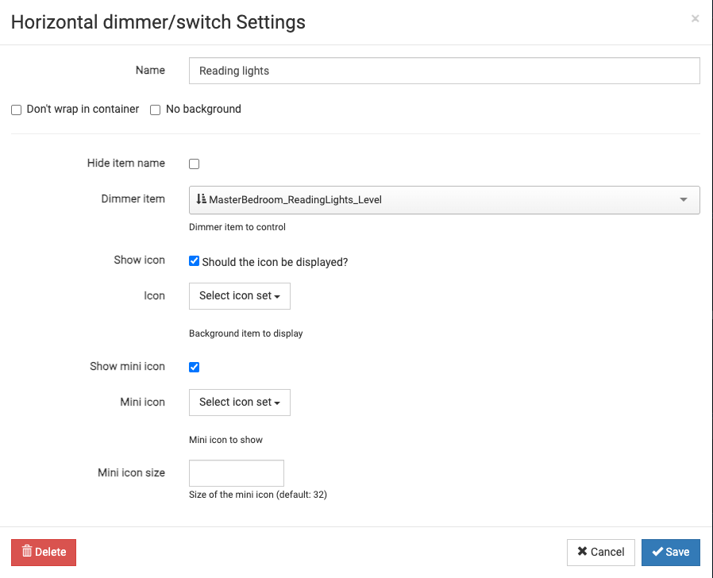

# Dimmer widget for HABPanel

## Description
A dimmer widget that combines a slider for dimmer control and a switch for the widget.  This enables you to turn on/off the dimmer to a defined value or use the slider to control the dimmer.

## Installation

1. Download the [Horizontal Dimmer.widget.json](./Horizontal%20Dimmer.widget.json) file
   - Import the downloaded file into HABPanel
3. Create a dashboard and add the Horizontal Dimmer widget
   - Edit the widget and set the openHab dimmer item that you want to control
   - Save the dashboard and run it

## Screenshot

* widget 

* config 
