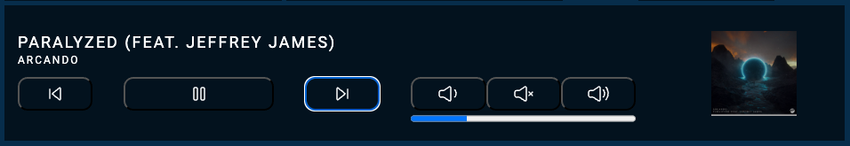
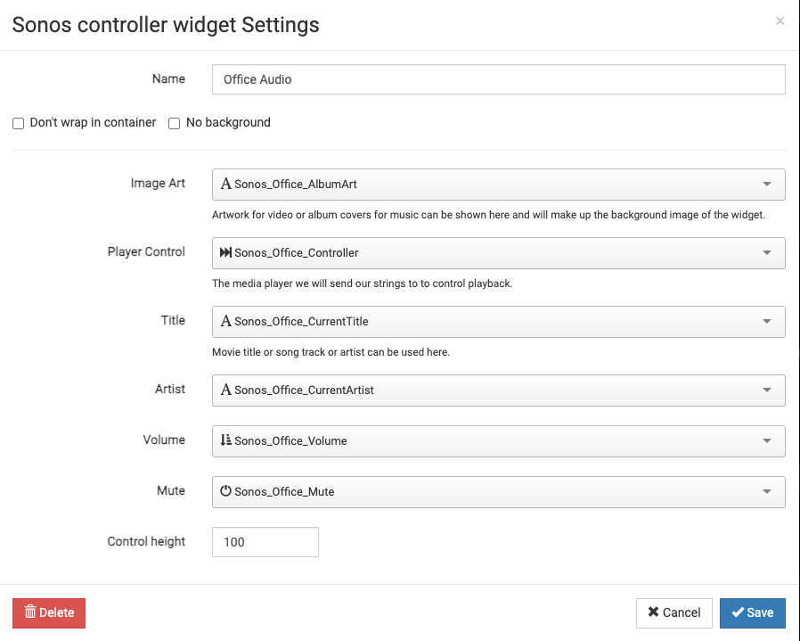

# Sonos controller for HABPanel

## Description
Sonos widget for openHAB's HABPanel groups common audio controls into a single widget.  The widget was designed to fit into a single row on a display with a resolution of 800x480.

## Installation

1. Install and configure the [Sonos add-on](https://www.openhab.org/addons/bindings/sonos/) Once the Sonos addon is installed and a thing is configred the following Channels will need to have items created for them
   - control
   - volume
   - mute
   - currentartist
   - currenttitle
   - currentalbumart
   - If you are using configuration files the following Items will need to be added to allow the widget to control your Sonos speaker.
```
Player    Sonos_Office_Controller        "Controller"                                 (Office)     ["Speaker"]    {channel="sonos:One:office:control"}
Dimmer    Sonos_Office_Volume            "Volume [%.1f %%]"     <soundvolume>         (Office)     ["Speaker"]    {channel="sonos:One:office:volume"}
Switch    Sonos_Office_Mute              "Mute"                 <soundvolume_mute>    (Office)     ["Speaker"]    {channel="sonos:One:office:mute"}
String    Sonos_Office_CurrentArtist     "Artist: %s"           <text>                (Office)     ["Speaker"]    {channel="sonos:One:office:currentartist"}
String    Sonos_Office_CurrentTitle      "Track title: %s"      <text>                (Office)     ["Speaker"]    {channel="sonos:One:office:currenttitle"}
String    Sonos_Office_AlbumArt          "Album picture: %s"    <text>                (Office)     ["Speaker"]    {channel="sonos:One:office:currentalbumarturl"}
```

2. Download the Sonos.widget.json file
   - Import the downloaded file into HABPanel
3. Create a dashboard and add the Sonos widget
   - Edit the widget and set the openHab items that you defined for the required channels
   - Save the dashboard and run it

## Screenshot
* widget<br/>

* configuration<br/>
